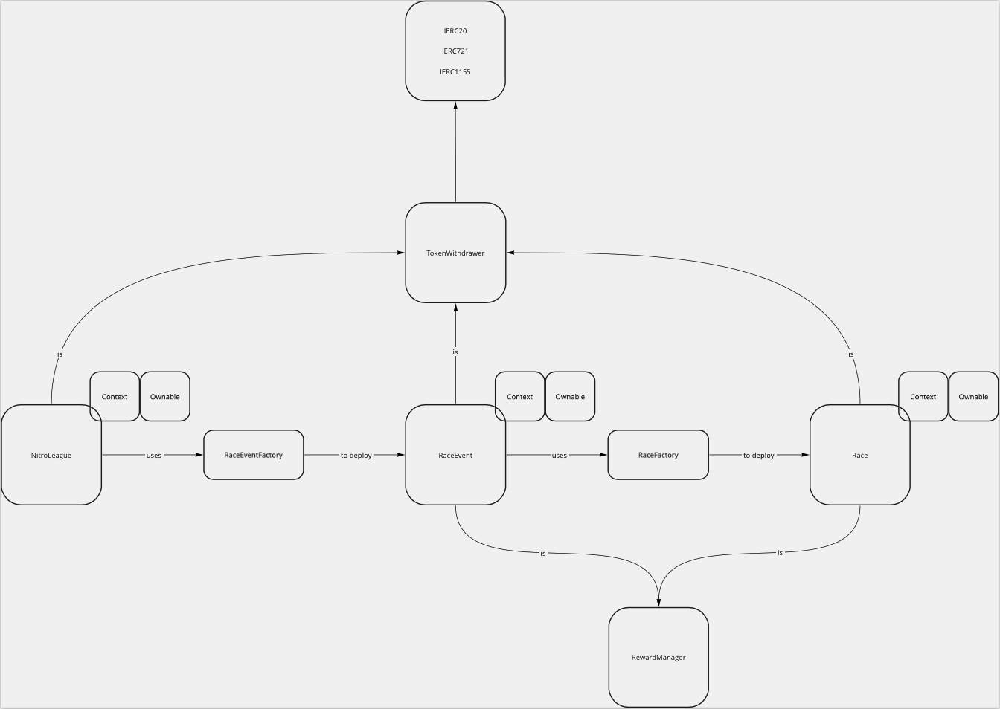

# Nitro League Contracts

## Architecture

NitroLeague deploys RaceEvent via RaceEventFactory.

RaceEvent deploys Race via RaceFactory.

After Race is deployed, call Race.setRaceSettings(...)

Rewards are added to NitroLeague, RaceEvent, Race via inherited RewardManager.

Tokens are withdrawn from NitroLeague, RaceEvent, Race via inherited TokenWithdrawer. There are limits on withdrawing tokens while rewards are unclaimed.

[Miro](https://miro.com/app/board/uXjVOo1UiF8=/?share_link_id=270614917881)



## Notes

Interfaces are used to allow interactions between contracts without requiring callers to carry the called contract's bytecode.

## Addresses

### Mainnet

None.

### Testnet (Avalanche Fuji C-Chain)

#### NitroLeague
[0x91A153bB7478c8a73aE1FAe4754ea73A12B0b7AB](https://testnet.snowtrace.io/address/0x91A153bB7478c8a73aE1FAe4754ea73A12B0b7AB)

#### RaceEventFactory
[0x0F791DBF7281b5e178761FE2262fD7bd0772B794](https://testnet.snowtrace.io/address/0x0F791DBF7281b5e178761FE2262fD7bd0772B794)

#### RaceFactory
[0xB6Cd52B65D4600Ba267127905b83c32096fF24d9](https://testnet.snowtrace.io/address/0xB6Cd52B65D4600Ba267127905b83c32096fF24d9)

#### RewardFactory
[0x4f6bE69b9242e83F8d3eA1E645dc377759B9eB0a](https://testnet.snowtrace.io/address/0x4f6bE69b9242e83F8d3eA1E645dc377759B9eB0a)

#### RaceEvent
[0xEb802a211E6A188cD24a8DD7E51861EB20D26932](https://testnet.snowtrace.io/address/0xEb802a211E6A188cD24a8DD7E51861EB20D26932)

#### Race
[0xbA467e6C7bF37Ba620857C6c01A37f6e8ebb6797](https://testnet.snowtrace.io/address/0xbA467e6C7bF37Ba620857C6c01A37f6e8ebb6797)

#### RewardManager
[0x08c8f6bc7a4773E785AF321149D79E7315eE551C](https://testnet.snowtrace.io/address/0x08c8f6bc7a4773E785AF321149D79E7315eE551C)

#### ERC20Token
[0x9bfb7bD31b26e3547D6442B187b3bC78aC1FD41a](https://testnet.snowtrace.io/address/0x9bfb7bD31b26e3547D6442B187b3bC78aC1FD41a)

#### ERC721NFT
[0xcC85a83134F04c592720499EC0D2176D4DC31a41](https://testnet.snowtrace.io/address/0xcC85a83134F04c592720499EC0D2176D4DC31a41)

#### ERC1155NFT
[0xaf13bE830fc5970a48eDc519AD852391ea9393de](https://testnet.snowtrace.io/address/0xaf13bE830fc5970a48eDc519AD852391ea9393de)

#### TokenWithdrawer
[0x526D0aDd1b0C7353E32D65e120a49b0E8D29886A](https://testnet.snowtrace.io/address/0x526D0aDd1b0C7353E32D65e120a49b0E8D29886A)


### Testnet (Binance Smart Chain)

#### NitroLeague
[0x54354cC4617E228C725c96f0dEAD9fFf88043cBB](https://testnet.bscscan.com/address/0x54354cC4617E228C725c96f0dEAD9fFf88043cBB)

#### RaceEventFactory
[0x113e31A8a8AAE84ab823e4c23C257f645bed80F1](https://testnet.bscscan.com/address/0x113e31A8a8AAE84ab823e4c23C257f645bed80F1)

#### RaceFactory
[0x62d9a80802b36DA729e989D1825E491989695B60](https://testnet.bscscan.com/address/0x62d9a80802b36DA729e989D1825E491989695B60)

#### RewardFactory
[0xc2F483e265A5d24c5a602DaA7C73b2EE09fBA81D](https://testnet.bscscan.com/address/0xc2F483e265A5d24c5a602DaA7C73b2EE09fBA81D)

#### RaceEvent
[0xDA496044679c9f007ACC4556f3DEFE8c5b4355d5](https://testnet.bscscan.com/address/0xDA496044679c9f007ACC4556f3DEFE8c5b4355d5)

#### Race
[0x7B1bFeF9Cc4A6B63408076B9A35EF275694efA31](https://testnet.bscscan.com/address/0x7B1bFeF9Cc4A6B63408076B9A35EF275694efA31)

#### RewardManager
[0x8C44aBD9b3Bd170DDb85347F6f87d90fCC42e648](https://testnet.bscscan.com/address/0x8C44aBD9b3Bd170DDb85347F6f87d90fCC42e648)

#### ERC20Token
[0x5ce11024b768B77d5B1037795FC4B68D24adcF3F](https://testnet.bscscan.com/address/0x5ce11024b768B77d5B1037795FC4B68D24adcF3F)

#### ERC721NFT
[0xd60DB3765CB0B7c7a25a6d7b56C14F109c776937](https://testnet.bscscan.com/address/0xd60DB3765CB0B7c7a25a6d7b56C14F109c776937)

#### ERC1155NFT
[0x0D3Fe1Fcf676DC1CDB2AfebE548f016875f740CE](https://testnet.bscscan.com/address/0x0D3Fe1Fcf676DC1CDB2AfebE548f016875f740CE)


## Scripts:

#### Deploy contracts:

```
npx hardhat run scripts/deploy.js --network AVAXFUJI
```

#### Verify the contracts:

```
./scripts/verify.sh
```

#### Test-run the complete race flow:

```
npx hardhat test --show-stack-traces
```


## Hardhat

### Hardhat tutorial:

https://hardhat.org/tutorial/

https://docs.polygon.technology/docs/develop/hardhat/

### Using Hardhat:

Install packages:

```
npm install
```

- Create a new account in MetaMask.
- Get Matic from the Polygon [faucet](https://faucet.polygon.technology/).
- Export the account's private key from MetaMask.
- Add that private key to network.yourNetwork.accounts in hardhat.config.js.

Run local hardhat node using npm:

```
npm exec hardhat node
```

If error:

  `OpenSSL error ERR_OSSL_EVP_UNSUPPORTED:`

or

  `Error HH604: Error running JSON-RPC server: error:0308010C:digital envelope routines::unsupported`

run:

```
export NODE_OPTIONS=--openssl-legacy-provider
```

If error:

  `node: --openssl-legacy-provider is not allowed in NODE_OPTIONS`

run:

```
unset NODE_OPTIONS
```

Run a script (from root dir, same level as hardhat.config.js):

```
npx hardhat run --network <your-network> scripts/<your-script>.js
```

### Flattening contracts

The script for flattening contracts can be found in:

```
<version>/scripts/flatten.sh
```

To flatten contracts, from a UNIX command line, while in the root directory of the desired version, run:

```
sh scripts/flatten.sh
```

Flattened contracts can be found in:

```
<version>/dapp-files/flattened/<section>/<contractname>_flat.sol
```

### Generating ABI's

The script for generating ABI's can be found in:

```
root/scripts/abi.js
```

To generate ABI's, using node, while in the root directory of the desired version, run:

```
node scripts/abi.js
```

ABI's can be found in:

```
root/dapp-files/abi/<section>/<contractname>_ABI.sol
```

### Verify contracts on Polygonscan

To verify contracts on Polygonscan, run:

```
npx hardhat verify --network <network> <address> <constructor args1> <constructor args2> <...>
```

Notes:
- Contracts must be deployed to `<network>`
- `<network>` must be in `hardhat.config.js`
- Contracts need to be validated by enough nodes. May require waiting ~5 minutes.
- `optimizer` config in `hardhat.config.js` must match optimizer config that contracts were deployed with.
- `etherscan.apiKey` in `hardhat.config.js` must be valid.

### Claim tokens

ERC20, ERC721, ERC1155 tokens can be automatically claimed using the `claim-tokens` script.

To do so, run:

```
npx hardhat run --network <network> scripts/claim-tokens.js
```

Ensure that `claimerAddress` and contract addresses are set appropriately.

### Full Test

The NitroLeague->RaceEvent->Race flow can be tested using `tests/full_test.js`.

To do so, run:

```
npx hardhat run --network <network> tests/full_test.js
```

Addresses in script will need to be updated.

Timestamp comparison between Ethers and the blockchain can cause issues. See comment in script.